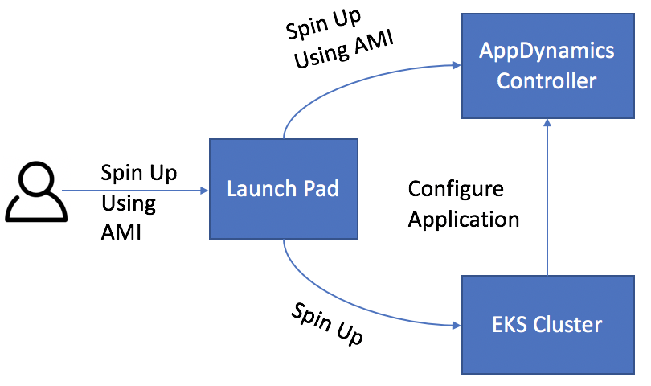

## Overview

Amazon Elastic Container Service for Kubernetes (EKS) makes it easy to operate Kubernetes clusters, but performance monitoring remains a top challenge. AppDynamics seamlessly integrates into EKS environments, providing insights into the performance of every microservice deployed, along with container and K8s visibility, all through a single pane of glass. On the heels of announcing the general availability of AppDynamics for Kubernetes at KubeCon Europe, we’ve partnered with Amazon Web Services (AWS) to bring Amazon EKS to the broader Kubernetes community. AppDynamics provides enterprise-grade, end-to-end performance monitoring for applications orchestrated by Kubernetes.

## Monitoring Amazon EKS with AppDynamics

EKS makes it easier to operate Kubernetes clusters; however, performance monitoring remains one of the top challenges in Kubernetes adoption. In fact, according to a recent CNCF survey, 46% of enterprises reported monitoring as their biggest challenge. Specifically, organizations deploying containers on the public cloud, cite monitoring as a big challenge. Perhaps because cloud providers monitoring tools may not play well with organization’s existing tools which are used to monitor on-premises resources.

## How Does it Work?

AppDynamics seamlessly integrates into EKS environments. The machine agent runs as a DaemonSet on EKS worker nodes, and application agents are deployed alongside your application binaries within the application pods. Out-of-the-box integration gives you the deepest visibility into EKS cluster health, AWS resources and Docker containers, and provides insights into the performance of every microservice deployed—all through a single pane of glass.

## Workshop Overview

We have created a multi-service application containerized with Docker that is ready to deploy to AWS using EKS. As part of the workshop, you will deploy the application on EKS and walkthrough the steps to establish full stack monitoring for the application.

  

## Lab Exercises
 

| Lab Exercise | Description                                | Estimated Time |
| :----------: | :----------------------------------------- | :------------: |
|      1       | Launch First EC2 Instance                  |   10 minutes   |
|      2       | Clone Github Repos & Configure EKS Cluster |   15 minutes   |
|      3       | Launch Second EC2 Instance                 |   10 minutes   |
|      4       | Deploy AD-Capital Application to EKS       |   35 minutes   |
|      5       | Deploy Machine Agents to EKS               |   20 minutes   |
|      6       | Deploy the Kubernetes Extension to EKS     |   30 minutes   |

  
To ease the effort, we have created a couple of AMIs using automated tooling. The following diagram explains the workflow of the labs and how participants will interact:

1. [Launch First EC2 Instance (e.g. Launch Pad EC2)](lab-exercise-01.md)
   - In this step you will launch the first EC2 instance that will be used to clone two Github repositories and configure an EKS cluster in the next step.  
2. [Clone Github Repositories & Configure an EKS Cluster](lab-exercise-02.md)
   - In this step you will use the Launch Pad EC2 instance to clone two Github repositiories and configure a Kubernetes cluster within AWS EKS.  
3. [Launch Second EC2 Instance (e.g. Controller EC2)](lab-exercise-03.md)
   - In this step you will launch the second EC2 instance that will run the AppDynamics Enterpise Console, Controller, and Events Service.  
4. [Deploy AD-Capital Application to EKS](lab-exercise-04.md)
   - In this step you will use the Launch Pad EC2 instance to deploy the AD-Capital application to the EKS cluster and monitor the results of the deployment in the AppDynamics Controller.  
5. [Deploy the Server Agent & Network Agent to EKS](lab-exercise-05.md)
   - In this step you will use the Launch Pad EC2 instance to deploy the Server Agent and Network Agent to the EKS cluster and monitor the results of the deployment in the AppDynamics Controller.  
6. [Deploy the Kubernetes Extension to EKS](lab-exercise-06.md)
    - In this step you will use the Launch Pad EC2 instance to deploy the AppDynamics Kubernetes extension to the EKS cluster, and monitor the results of the deployment in the AppDynamics Controller, and create a custom dashboard.  
 

Overview | [1](lab-exercise-01.md), [2](lab-exercise-02.md), [3](lab-exercise-03.md), [4](lab-exercise-04.md), [5](lab-exercise-05.md), [6](lab-exercise-06.md), | Back | [Next](lab-exercise-01.md)
