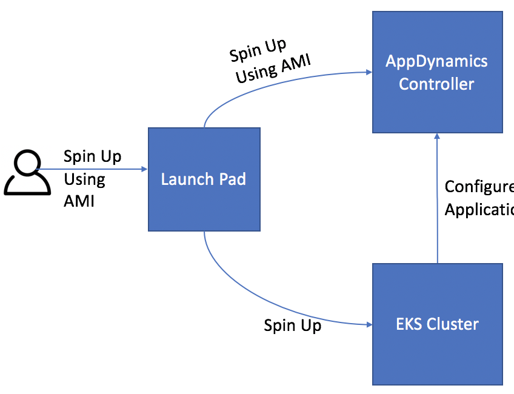

# AWS EKS Monitoring

AWS EKS Monitoring Lab Guide.

## Overview

We had a multi-service application wrapped in docker that we wanted to deploy to AWS using EKS. As part of the workshop we will deploy application on EKS and walkthrough steps to establish full stack monitoring for the application.

  

## Lab Exercises
 

| Lab Exercise | Description                             | Estimated Time |
| :----------: | :-------------------------------------- | :------------: |
|      1       | Launch First EC2 Instance               |   10 minutes   |
|      2       | Clone Github Repos & Create EKS Cluster |   15 minutes   |
|      3       | Launch Second EC2 Instance              |   10 minutes   |
|      4       | Delpoy AD-Capital Application to EKS    |   35 minutes   |
|      5       | Delpoy Machine Agents to EKS            |   20 minutes   |
|      6       | Delpoy the Kubernetes Extension to EKS  |   30 minutes   |
|      7       | Monitoring the Application              |   15 minutes   |

  

1. [Launch First EC2 Instance (e.g. Launch Pad EC2)](lab-exercise-01.md)
   - In this step you will launch the first EC2 instance
   that will be used to clone two Github repositories and create the EKS cluster in the next step.  
2. [Clone Github Repositories & Create EKS Cluster](lab-exercise-02.md)
   - In this step you will use the Launch Pad EC2 instance to clone two Github repositiories and create a new Kubernetes cluster within AWS EKS.  
3. [Launch Second EC2 Instance (e.g. Controller EC2)](lab-exercise-03.md)
   - In this step you will launch the second EC2 instance that will run the AppDynamics Enterpise Console, Controller, and Events Service.  
4. [Delpoy AD-Capital Application to EKS](lab-exercise-04.md)
   - In this step you will use the Launch Pad EC2 instance to deploy the AD-Capital application to the EKS cluster and monitor the results of the deployment in the AppDynamics Controller.  
5. [Delpoy the Server Agent & Network Agent to EKS](lab-exercise-05.md)
   - In this step you will use the Launch Pad EC2 instance to deploy the Server Agent and Network Agent to the EKS cluster  and monitor the results of the deployment in the AppDynamics Controller.  
6. [Delpoy the Kubernetes Extension to EKS](lab-exercise-06.md)
    - In this step you will use the Launch Pad EC2 instance to deploy the AppDynamics Kubernetes extension to the EKS cluster, and monitor the results of the deployment in the AppDynamics Controller, and create a custom dashboard.  
7. [Monitoring the Application](lab-exercise-07.md)
    - In this step you will use the controller to monitor application and out of the box Kubernetes dashboard.  
 

[Overview](aws-eks-monitoring.md) | [1](lab-exercise-01.md), [2](lab-exercise-02.md), [3](lab-exercise-03.md), [4](lab-exercise-04.md), [5](lab-exercise-05.md), [6](lab-exercise-06.md), [7](lab-exercise-07.md) | [Back](aws-eks-monitoring.md) | [Next](lab-exercise-01.md)
