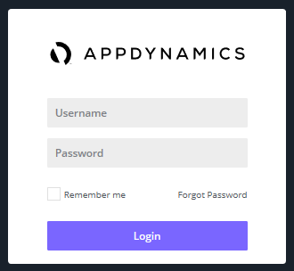
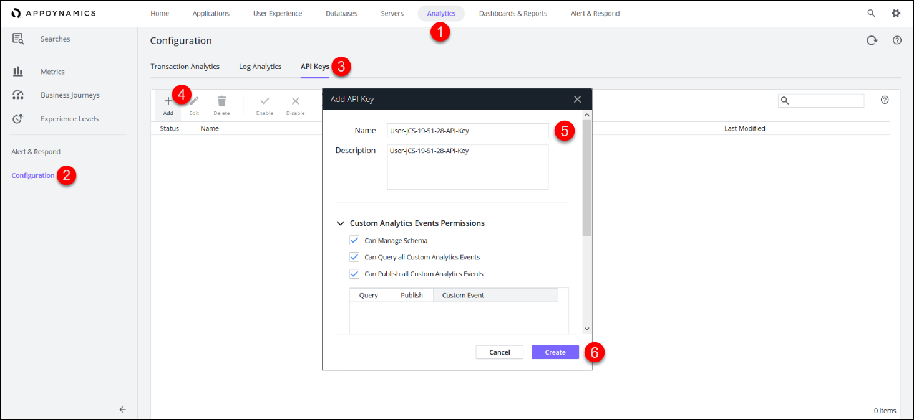
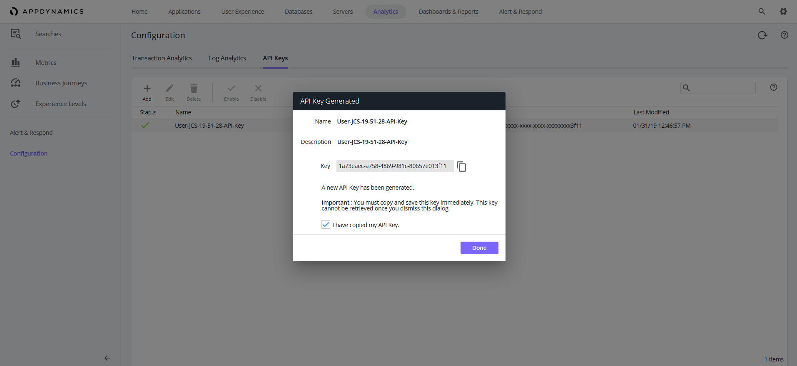

# Lab Exercise 4
## Delpoy AD-Capital Application to EKS


In this exercise you will need to do the following:

- Validate that your EKS cluster has deployed properly
- Run a script to create a service account in your EKS cluster
- Create an API Key using the AppDynamics Controller
- Run a script to set environment variables for EKS deployment
- Run a script to deploy the AD-Capital application to EKS
- Monitor the results of the deployment in the AppDynamics Controller

<br>

### **1.** Validate Your EKS Cluster
Using the SSH terminal for the Launch Pad EC2 instance, run the commands below to validate your EKS cluster creation is complete and running.

<br>

```
cd /home/ec2-user/AppD-Cloud-Kickstart/applications/aws/AD-Capital-Kube

kubectl get nodes

kubectl get namespace
```
You should see output from the commands similar to the image seen below.


<br>

### **2.** Create a Service Account in EKS Cluster
Now run the commands below to create a service account in your EKS cluster.

```
cd /home/ec2-user/AppD-Cloud-Kickstart/applications/aws/AD-Capital-Kube

./create_eks_service_account.sh
```
You should see output from the commands similar to the image seen below.


<br>

### **3.** Create an API Key using AppDynamics Controller
Open your web browser and login to your controller.  The URL you need to use is like the one below.  You can find your controller's public IP address or public host name in the AWS console.

*http://controller-ip-or-hostname:8090/controller/*

You should see the controller's login screen as seen in the image below.  The default user name and password are listed below. Login into the controller.

- Username: admin
- Password: welcome1
  


<br>

Once logged into the controller, navigate to the Analytics module and create the API key using the steps below:

1. Click on the Analytics tab on the top menu
2. Click on the Configuration tab on the left menu
3. Click on the API Keys tab on the middle menu
4. Click the Add button with the **+** symbol
5. Fill in the name, description, and check the 3 boxes seen in the image below
6. Click the Create button




<br>
After you click the Create button you will see the next screen below.  Copy the API key and save it in a text file for the next step.



<br>

### **4.** Set Environment Variables for EKS Deployment
Run the command below to set the variable for the controller host, replacing 'your-controller-host-name-or-ip' with the public IP address or public host name of your controller: 

```
export appd_controller_host=your-controller-host-name-or-ip
```

Now run the next command below to set the variable for your API key, replacing 'your-api-key' with the API key you just created:

```
export appd_es_api_key=your-api-key
```
Run the commands below to complete the process of setting all the variables needed to deploy to the EKS cluster:

```
cd /home/ec2-user/AppD-Cloud-Kickstart/applications/aws/AD-Capital-Kube

./create_env_configmap.sh
```


<br>

[Overview](aws-eks-monitoring.md) | [1](lab-exercise-01.md), [2](lab-exercise-02.md), [3](lab-exercise-03.md), [4](lab-exercise-04.md), [5](lab-exercise-05.md), [6](lab-exercise-06.md) | [Back](lab-exercise-03.md) | [Next](lab-exercise-05.md)